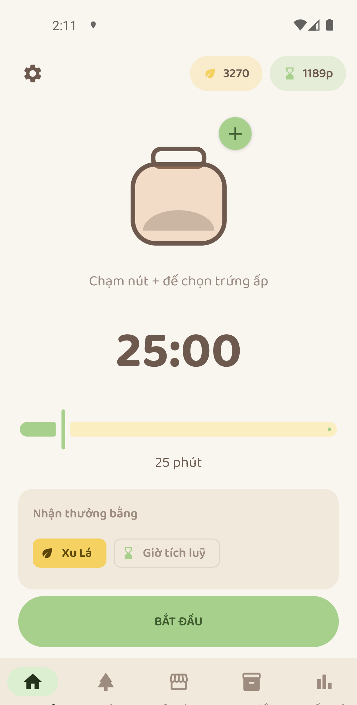
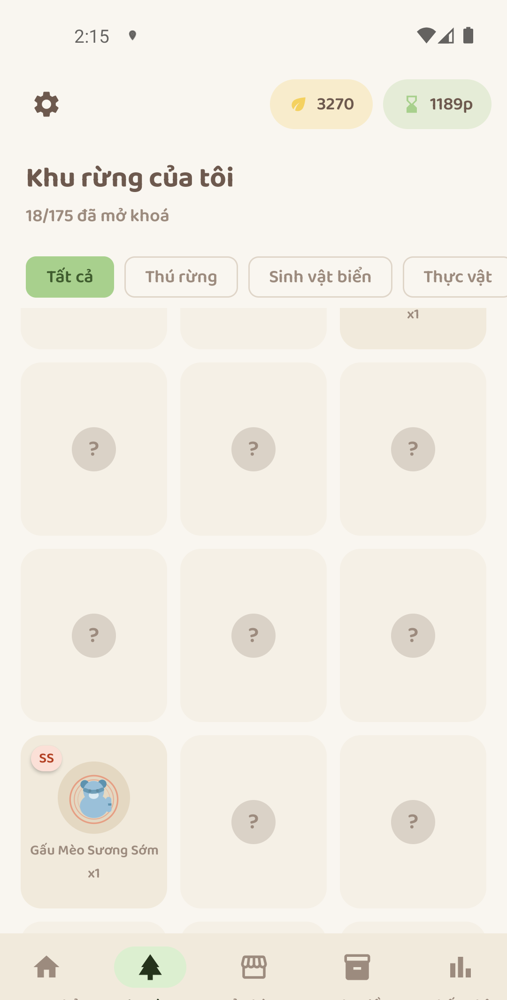
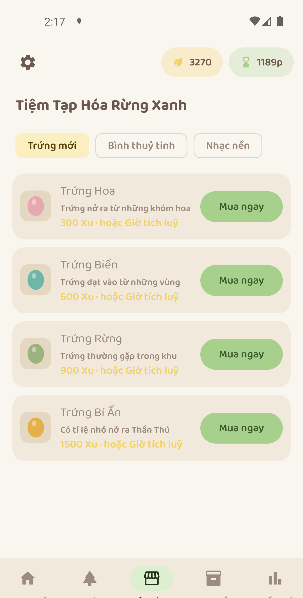
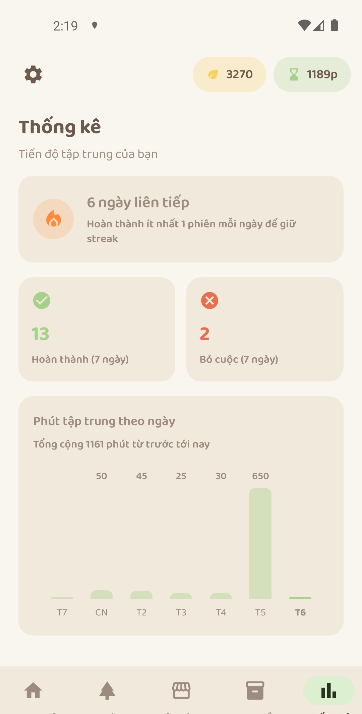

<div align="center">


# CozyPomo

**Ứng dụng Pomodoro với cơ chế ấp trứng và nuôi lớn một khu rừng sinh vật của riêng bạn.**

Native Android (Kotlin, Jetpack Compose) · NestJS + PostgreSQL backend · phong cách cozy pastel

[](https://github.com/nhockool1002/cozy-pomo-focus-app/actions/workflows/android-release.yml)
[](https://github.com/nhockool1002/cozy-pomo-focus-app/actions/workflows/backend-deploy.yml)
[](https://github.com/nhockool1002/cozy-pomo-focus-app/releases)

</div>

---

## Giới thiệu

Mỗi phiên tập trung trong CozyPomo không chỉ là một quả chuông báo hết giờ — nó là một bước ấp nở. Bạn chọn một quả trứng đang sở hữu, bắt đầu đếm giờ, và thời gian tập trung của bạn dần ấp nở nó thành một trong 175 loài sinh vật (5 cấp độ hiếm, từ B tới SSR huyền thoại). Càng tập trung đều, khu rừng của bạn càng đầy thêm.

Ứng dụng có backend riêng (không phụ thuộc dịch vụ bên thứ ba) để lưu tiến trình theo tài khoản, đồng bộ nhiều thiết bị, và cho phép quản trị nội dung (loài, tỉ lệ rơi, vật phẩm cửa hàng) qua trang admin mà không cần phát hành lại app.

<p align="center">
  
  
  
  
</p>

## Tính năng

- **Đếm giờ Pomodoro chính xác** qua Foreground Service (`SystemClock.elapsedRealtime()`), hoạt động đúng kể cả khi khoá màn hình.
- **Kinh tế 2 tiền tệ** — Xu Lá và Giờ tích luỹ, quy đổi 1:10, người chơi chọn nhận 1 trong 2 loại mỗi phiên.
- **Trứng ấp dần theo instance sở hữu riêng** — mua trứng ở Cửa hàng, chọn ấp trứng nào (hoặc không ấp) mỗi phiên, trứng tự nở khi đủ số phút.
- **175 loài sinh vật**, 5 cấp độ hiếm (B/A/S/SS/SSR), mỗi loài có ảnh vẽ thủ tục (procedural art) sinh từ hạt giống ổn định theo tên.
- **Kho đồ** — đổi bình ấp và nhạc nền đã mua, xem tiến trình trứng đang sở hữu.
- **Thống kê** — streak, tổng phiên hoàn thành/bỏ cuộc, biểu đồ phút tập trung theo ngày.
- **Refresh-token tự động** — không cần đăng nhập lại mỗi 15 phút.
- Không quảng cáo, không theo dõi bên thứ ba, không giao dịch tiền thật.

## Kiến trúc & Tech Stack

| | |
|---|---|
| **Android** | Kotlin · Jetpack Compose + Material 3 · Hilt · Room · Retrofit/OkHttp · Navigation Compose · Coroutines/Flow |
| **Backend** | NestJS (TypeScript) · Prisma · PostgreSQL 16 · JWT (access + refresh) · AdminJS · Swagger/OpenAPI · Docker |
| **CI/CD** | GitHub Actions — tag `app-v*` build & ký AAB/APK, tag `backend-v*` build image → ghcr.io → SSH deploy lên aaPanel |

Chi tiết đầy đủ (Function List, endpoint REST, schema): [`docs/technical-spec.md`](docs/technical-spec.md).

## Cấu trúc repo

```
cozy-pomo-focus-app/
├── app/              # Android app (Kotlin, Jetpack Compose)
├── backend/          # NestJS API + Prisma + AdminJS + Docker Compose
└── docs/
    ├── technical-spec.md      # Tech stack, Screen List, Function List, backend
    ├── setup-checklist.md     # Checklist hạ tầng (GitHub/aaPanel/domain)
    ├── deploy_backend.md      # Hướng dẫn deploy backend từng bước
    ├── branding/              # Icon, favicon, logo chính thức
    ├── wireframes/            # Sơ đồ luồng màn hình (khớp bản build thật)
    └── play-store/            # Feature graphic, screenshots, Privacy Policy, hướng dẫn Data Safety/Content Rating
```

## Bắt đầu phát triển

### Android

```bash
cd app
./gradlew :app:assembleDebug     # build APK debug
./gradlew :app:compileDebugKotlin  # compile-check nhanh
```

Build debug trỏ về backend chạy local (`http://10.0.2.2:3000/api/v1/` từ emulator); build release trỏ production. Xem `app/app/build.gradle.kts`.

### Backend

```bash
cd backend
docker compose up -d              # NestJS + PostgreSQL local
npm run prisma:seed               # nạp 175 loài + 4 loại trứng + 10 tài khoản tester
```

API tại `http://localhost:3000/api/v1`, Swagger tại `/docs`, trang quản trị AdminJS tại `/admin`.

## Release & Deploy

Repo dùng GitHub Release làm cơ chế trigger deploy — không phải push thường:

- Tag `app-v<ngày>.<số thứ tự>` (VD `app-v1.20260724.002`) → build AAB + APK ký sẵn, đính kèm vào Release.
- Tag `backend-v<ngày>.<số thứ tự>` → build Docker image → đẩy `ghcr.io` → SSH deploy lên aaPanel.

Chi tiết: [`docs/deploy_backend.md`](docs/deploy_backend.md).

## Tài liệu

| Tài liệu | Nội dung |
|---|---|
| [`plan.md`](plan.md) | Trạng thái dự án ở mức task cụ thể — đã làm gì, còn gì, quyết định phạm vi |
| [`docs/technical-spec.md`](docs/technical-spec.md) | Tech stack, Screen List, Function List, kiến trúc backend, endpoint REST |
| [`docs/setup-checklist.md`](docs/setup-checklist.md) | Checklist thiết lập GitHub Secrets / aaPanel / domain |
| [`docs/deploy_backend.md`](docs/deploy_backend.md) | Hướng dẫn deploy backend từng bước |
| [`docs/wireframes/use-case-flow.html`](docs/wireframes/use-case-flow.html) | Sơ đồ luồng toàn bộ màn hình, khớp bản build thật |
| [`docs/play-store/README.md`](docs/play-store/README.md) | Chuẩn bị phát hành Play Store — feature graphic, screenshots, Privacy Policy, Data Safety, Content Rating |

## Giấy phép

Dự án hiện chưa chọn giấy phép mã nguồn mở — mã nguồn dùng nội bộ cho mục đích phát triển/phát hành sản phẩm.

## Tác giả

**Dev1002** — [Buy Me a Coffee](https://buymeacoffee.com/nhutnm)
